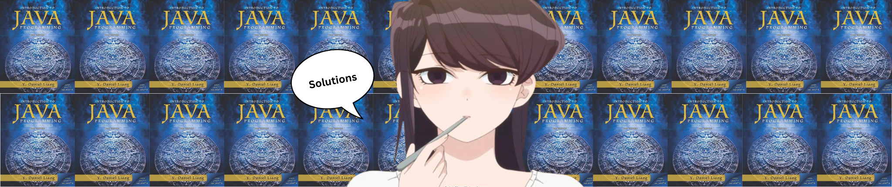

<h2 align="center">🃏 Introduction to Java Programming Solutions</h2>

Solutions to the programming exercises in <a href="https://www.amazon.com/Intro-Java-Programming-Comprehensive-Version/dp/0133761312">Introduction to Java Programming, Comprehensive Version (10th Edition)</a> By Y. Daniel Liang.</a> All of the answers have been checked correct through the Exercise Check Tool provided by the book. 

<h2 align="center">⚗️ Useful links for the book:</h2>

- <a href="http://liveexample.pearsoncmg.com/liang/intro10e">10th Edition Companion Website</a>
- <a href="https://liveexample.pearsoncmg.com/CheckExercise/faces/CheckExercise.xhtml?chapter=1&programName=Exercise01_01">Exercise Check Tool</a>
- <a href="https://liveexample.pearsoncmg.com/javarevel2e.html">Hints to Quizzes and Programming Projects</a>
- <a href='#checkpoint-answers'>Checkpoint Answers</a>
- <a href="https://media.pearsoncmg.com/ph/esm/ecs_liang_ijp_10/ExampleByChapters.html">Example Programs By Chapter</a>
- <a href="http://liveexample.pearsoncmg.com/liang/animation/animation.html">Algorithm Animations</a>
- <a href="https://media.pearsoncmg.com/ph/esm/ecs_liang_ijp_10/supplement/Supplement1dcodingguidelines.html">Java Coding Style Guidelines</a>

## License & copyright
© Licensed under the [MIT License](LICENSE).

